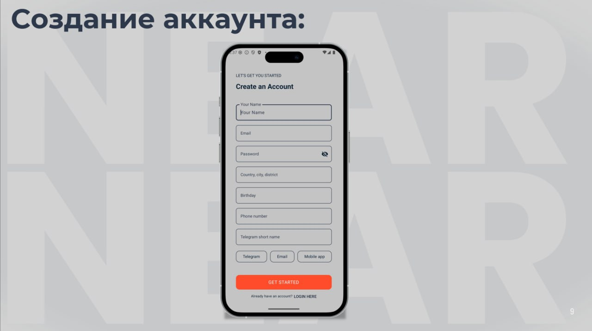
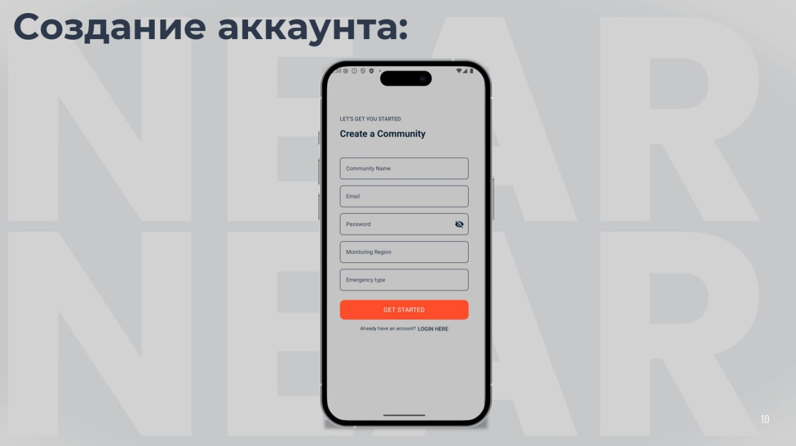
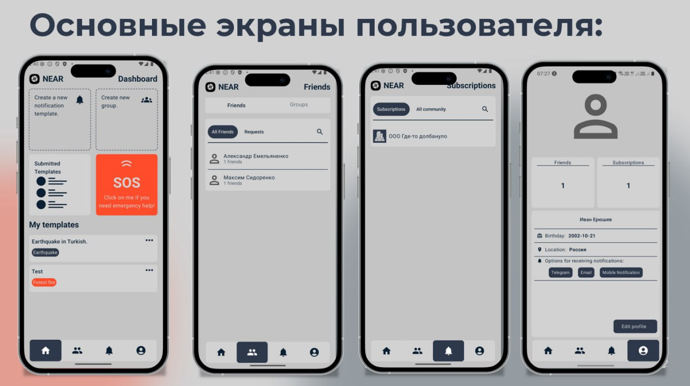
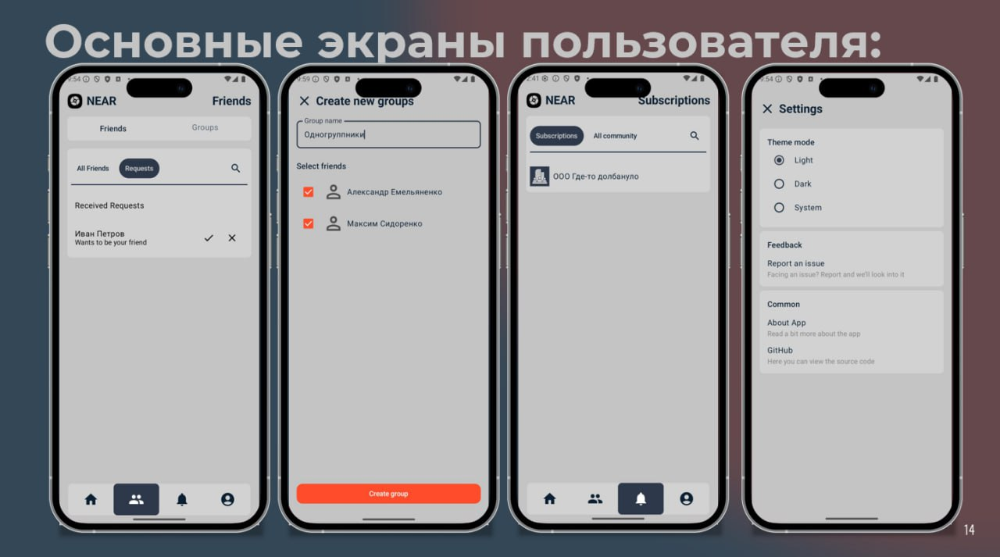
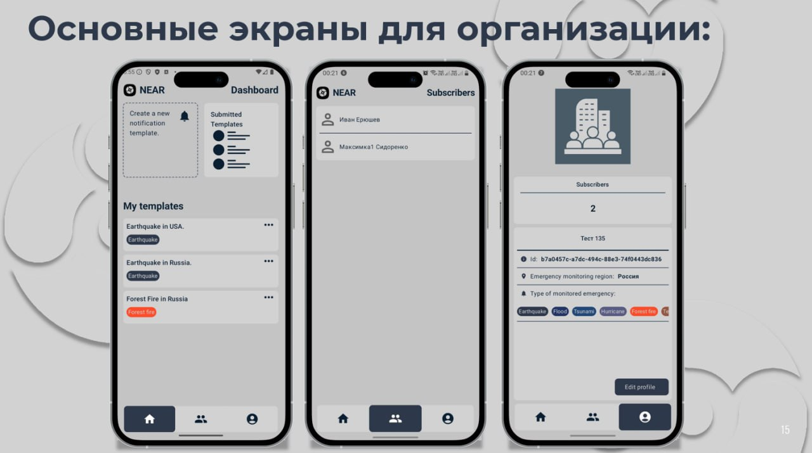
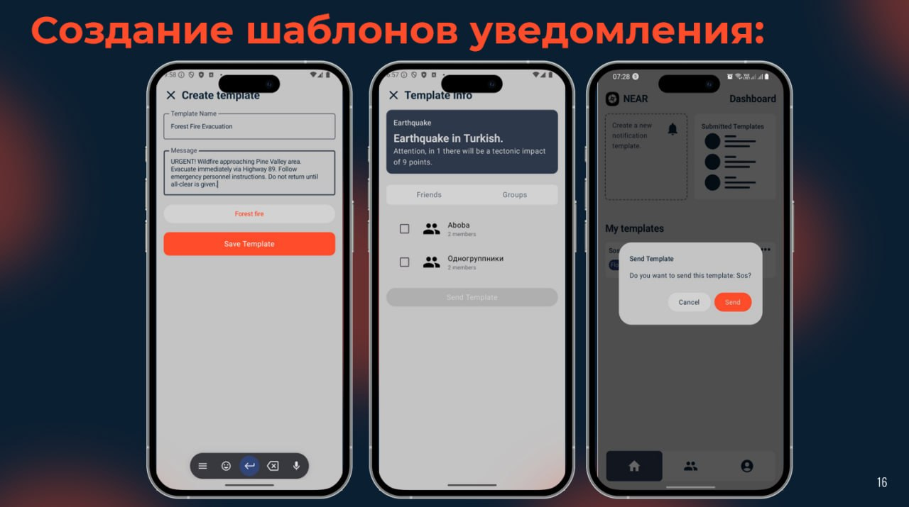

# NEAR-Mobile

## 📌 Overview

Android application for emergency alerts in a social network format. Allows users and organizations to create, manage, and receive real-time emergency notifications.

## 🖼️ Screenshots

### Registration Screens

### Account Screens

### Community Screens

### Template Screens

